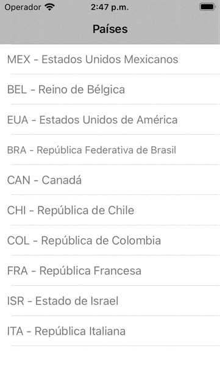

# MVP + Coordinators
Example of a Model-View-Presenter (MVP) + Coordinators implementation.

# Introduction
This sample project fetches a list of countries from a URL. Whenever a row is selected, a sheet with the country name shows.

# Overview
The main screen fetches a list of countries from a URL generated using Postman's mock servers. Whenever the user taps on a country, a check icon appears in the tapped cell and a sheet shows the name of the selected country.

The view controllers, views and constraints are coded and the initial storyboard was deleted.

# Architecture
The project is based on the Model-View-Presenter (MVP) + Coordinators architectural pattern.

The project contains two modules: 
- **Countries**: shows the list of countries fetched.
- **Selected modal**: shows a sheet with the name of the selected country. 
*Both modules are in the Modules folder.*

To control the navigation, the app relies on coordinators. Coordinators allow extracting the navigation logic from the view controller, thereby making them lighter. The view controllers only contain the code needed to show the UI elements and respond to user interactions.

The *Countries* folder contains the coordinator and subfolders for each architecture component. Since the *SelectedModal* module logic is basic, no files related to the model and presenter components were added. Similarly, *SelectedModal* does not contain a coordinator and its view controller is presented directly from the Countries coordinator.

The folder *Repository* contains all the classes for retrieving the countries list. 
- *CountriesRespository.swift* defines the protocol that the classes must implement to get the countries list.
- *CountriesAPIRepository.swift* implements the protocol and contains the code to retrieve the countries from the Postman mock server.
- *MockCountriesRepository.swift* implements the same protocol, but in this class, the list of countries is created locally.

The Countries coordinator is responsible for initializing all the dependencies required by the module to work. Dependencies are provided to the classes through dependency injection.

# Technologies
- Swift
- UIKit

# Author
David Mendoza